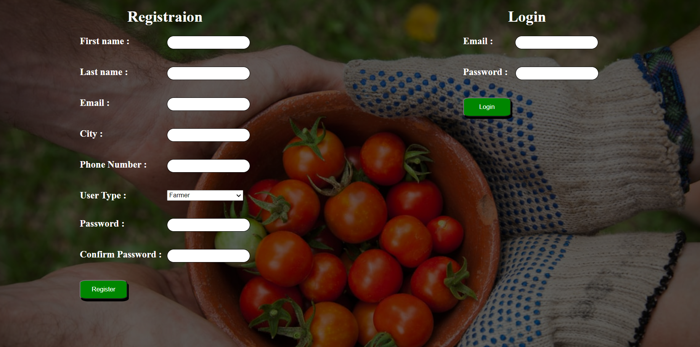

# Greengrocer

## Team Members : 
1. Jehad Issa
2. Maher Abdelkreem
3. Oday Qsrawi

## Abstract:
The main goal of this project is to make connection between farmers and traders, to make this 
connections easy we will establish a web site that allow the farmers and traders to register in this web 
site and the farmer will display his crops and traders will be able to connect with a farmer.

## Requirement :
1. We will create a home page that display the purpose of this web site and will contain the 
information to connect to the admin and login and registration process.

2. When the user enter as trader he will redirect the traders page , and when the user enter as a 
farmer he will redirect to the farmers page.

3. farmer will be able to :
      * Add a Crop : the farmer can add crop be clicking in add crop button in the nav bar ,then he will redirict to the add crop page and enter the details
      for the crop ,also this detalis will be showen in the home page for the farmer 
      * Home page : In this page the farmer can see his own crops and the quantity saled ,also he can make an edit or delete in his crops  
      * Edit crop : the farmer can edit his own crop by clickung the edit button in the table that display all the crops.
      
4. trader will be able to : 
       * Home page : dispaly all added crops from farmers  and trader can search for specific crop. 
        The contact with farmer will be by phone number (in each crop there is a contact field )  
       * contact farmer : as we said the phone number will be the contact tool. 
        so when trader click in contact field trader will have the phone number for farmer and description of the crop 
         And trader can click on buy button to add this crop for his purchases 
       * Purchases crops : This page have a table of names of crops that trader buy and information about them.
       
 ## Tools :
 1. HTML
 2. CSS
 3. JQuery
 4. Django
 5. Bootstrap
 6. font awesome
 ## images of the site

